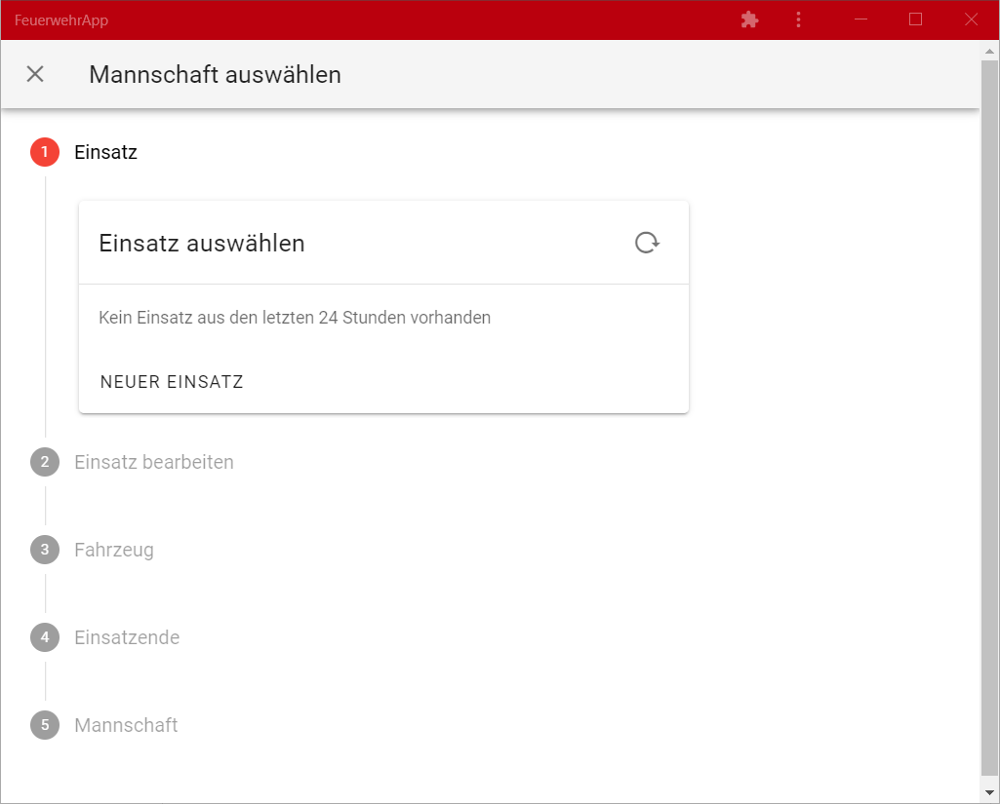
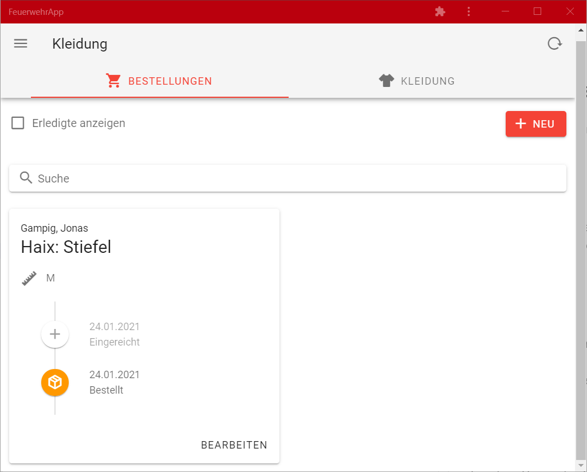

# FeuerwehrApp

FeuerwehrApp ist ein webbasiertes Tool für Feuerwehren, um verschiedene administrative Aufgaben zu erledigen.

# Features

Mannschaftsbuch
---------------

Mit FeuerwehrApp kann die Mannschaft eines Fahrzeuges nach einem Einsatz protokolliert werden.

Kleidung verwalten
------------------

Mit der App können Kleiderwarte offenen Bestellungen von Kameradinnen und Kameraden nachverfolgen. So verlieren sie nicht den Überblick über die Bestellungen.

Gerät einem Fahrzeug zuordnen
-----------------------------

Die App wurde vor allem für Fahrzeug-Tablets erstellt. Daher ist eine Grundfunktion, die Login-Daten für das jeweilige Fahrzeug fest einzuspeichern, damit sich dieses immer selbst anmeldet.

# Demo

Eine Live-Demo ist auf https://app.feuerwehr-parkstetten.de sichtbar. Da für die App ein Login benötigt wird, sind die unterstützten Funktionen dort allerdings nicht sichtbar.

# Hinweise für Entwickler

Die App ist in TypeScript geschrieben, welches in reguläres JavaScript kompiliert wird. Es baut auf dem Framework [Vue.js](https://vuejs.org/) auf, und verwendet [Vuetify](https://vuetifyjs.com/) für die UI-Komponenten.

Als Backend bzw. Datenbank wird [Firebase](https://firebase.google.com/) eingesetzt, wodurch eine eigene Entwicklung und Wartung des Backends entfällt.

## Entwicklung mit Visual Studio Code

### Einrichtung
- WSL 2 und Docker Desktop installieren ([Anleitung](https://code.visualstudio.com/blogs/2020/07/01/containers-wsl))
- Repository in einem WSL-Ordner clonen

### Öffnen
- Ordner mit VS Code in WSL öffnen
- Dev-Container öffnen (siehe dazu oben verlinkte Anleitung)
- Terminal in VS Code öffnen
  - `npm install` (nur erstmalig und bei Änderungen in NPM Dependencies)
  - `npm start`
