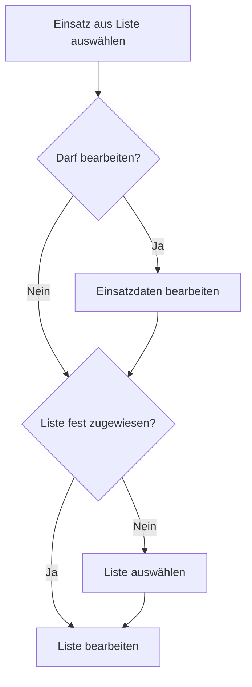

# Mannschaft eintragen

## Workflow

- *Liste* kann sein:
  - Bereitschaftsliste
  - Mannschaftsliste pro Fahrzeug
- Liste ist folgenden Benutzern fest zugewiesen:
  - Alarm-PC: Bereitschaftsliste
  - Fahrzeuge: Mannschaftsliste für jeweiliges Fahrzeug
- Liste bearbeiten:
  - Wenn Mannschaftsliste ausgewählt ist: Einsatzende eingeben
  - Personen auswählen
  - Funktionen zuweisen (Maschinist, Gruppenführer usw.)
